# Các luồng chính của app (bản đầu)

**Phiên bản 1.1** · Đi kèm *Tài liệu yêu cầu sản phẩm v1.1*. Số như "yêu cầu 1.4" trỏ về đúng mục đó trong tài liệu yêu cầu.

**Cách đọc:** mỗi luồng là một sơ đồ ngắn kèm vài dòng lưu ý. Trong sơ đồ, **"Người dùng"** là người đang cầm điện thoại, **"Người yêu"** là người còn lại trong cặp. Hình thoi là chỗ rẽ nhánh.

## Danh sách luồng

| # | Luồng | Yêu cầu liên quan |
| --- | --- | --- |
| 1 | Vòng lặp giá trị chính | Mục 0 và 1 |
| 2 | Bắt đầu dùng và mời người yêu | 1.1 đến 1.5, 1.13 |
| 3 | Người yêu chấp nhận lời mời | 1.6 đến 1.8, 1.11 |
| 4 | Chế độ chờ và nhắc mời | 1.9, 1.10, 4.8 |
| 5 | Check-in hằng ngày | 2.1 đến 2.11 |
| 6 | Hệ thống tạo Smart Nudge | 3.1, 3.7 đến 3.10 |
| 7 | Người dùng xử lý Smart Nudge | 3.2 đến 3.5 |
| 8 | Gửi và nhận Tiny Moment | 4.1 đến 4.7 |
| 9 | Quyết định có gửi thông báo không | 5.1 đến 5.7 |
| 10 | Kết thúc kết nối và xóa tài khoản | 1.12, 6.6 |
| 11 | Một ngày điển hình (dùng để nghiệm thu) | Toàn bộ |

---

## 1. Vòng lặp giá trị chính

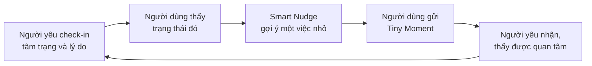

Mọi luồng sau đây có một mục đích: giữ cho vòng lặp này chạy liên tục. Hai chỗ dễ đứt nhất là **ghép đôi thất bại** (luồng 2 và 3) và **gợi ý không ai làm** (luồng 7).

---

## 2. Bắt đầu dùng và mời người yêu

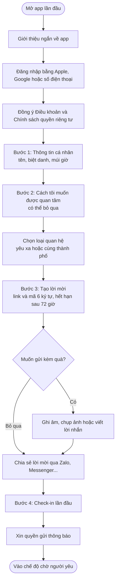

**Lưu ý:**

- Tối đa 4 bước chính trước khi người dùng thấy giá trị. Bước nào không bắt buộc phải cho bỏ qua.
- Chỉ xin quyền thông báo **sau** khi check-in lần đầu, không xin ngay khi mở app.
- Không hỏi tuổi ở bước đăng nhập.
- Nếu người dùng đã thuộc một cặp khác, chặn ở bước tạo lời mời và giải thích lý do.

---

## 3. Người yêu chấp nhận lời mời

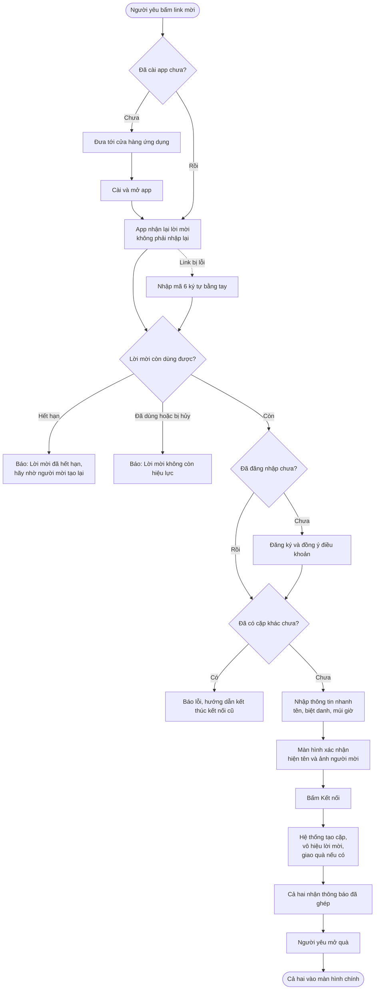

**Cần kiểm thử kỹ:**

- Chức năng "nhận lại lời mời sau khi cài app" trên cả iPhone và Android.
- Lời mời hết hạn đúng sau 72 giờ.
- Hai người cùng bấm chấp nhận một lúc: chỉ một lần thành công, không được tạo ra hai cặp.

---

## 4. Chế độ chờ và nhắc mời

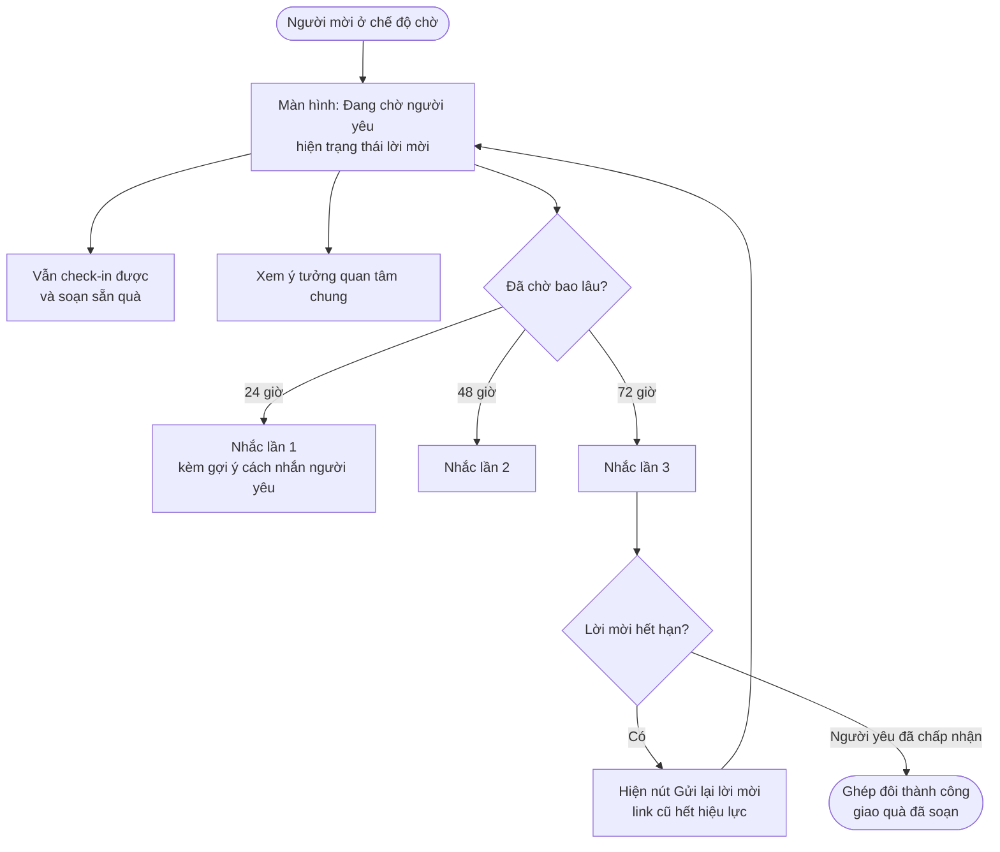

Nhắc tối đa 3 lần, dừng ngay khi ghép xong.

---

## 5. Check-in hằng ngày

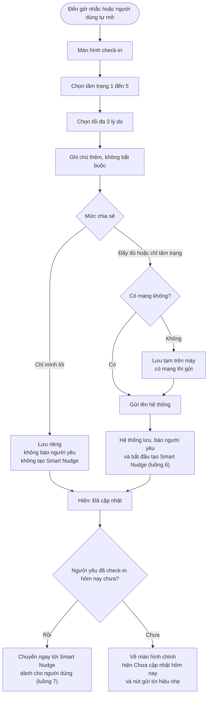

**Quy tắc:** check-in nhiều lần trong ngày được, lần mới nhất là trạng thái hiện tại. "Ngày" tính theo múi giờ của từng người.

---

## 6. Hệ thống tạo Smart Nudge

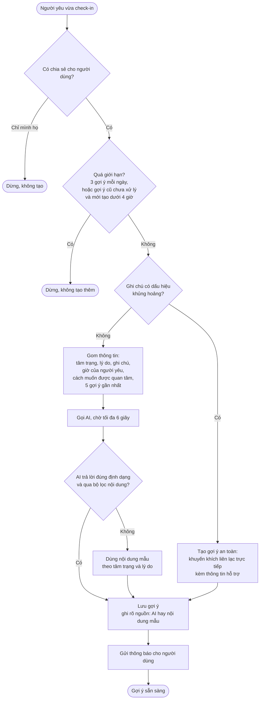

**Quy tắc quan trọng:**

- 95% gợi ý phải tạo xong trong dưới 4 giây.
- **Người dùng không bao giờ thấy lỗi AI.** AI hỏng thì dùng nội dung mẫu.
- Gợi ý hết hạn sau 24 giờ.

---

## 7. Người dùng xử lý Smart Nudge

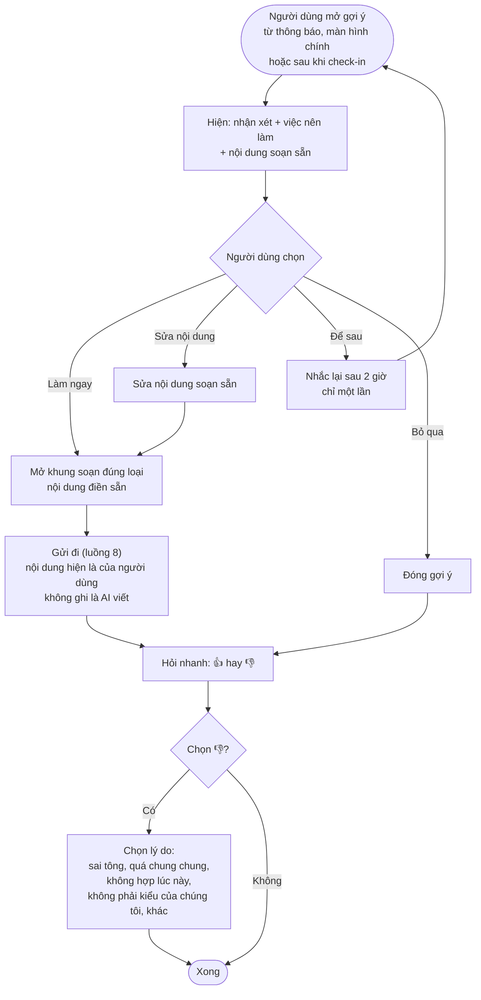

**Đây là luồng đo xem sản phẩm có giá trị thật không.** Hai chỉ số cần theo dõi: tỷ lệ bấm "Làm ngay" (mục tiêu từ 15%) và tỷ lệ 👎 vì "sai tông" (dưới 10%). Nếu chưa đạt, sửa nội dung gợi ý trước khi làm thêm tính năng khác.

---

## 8. Gửi và nhận Tiny Moment

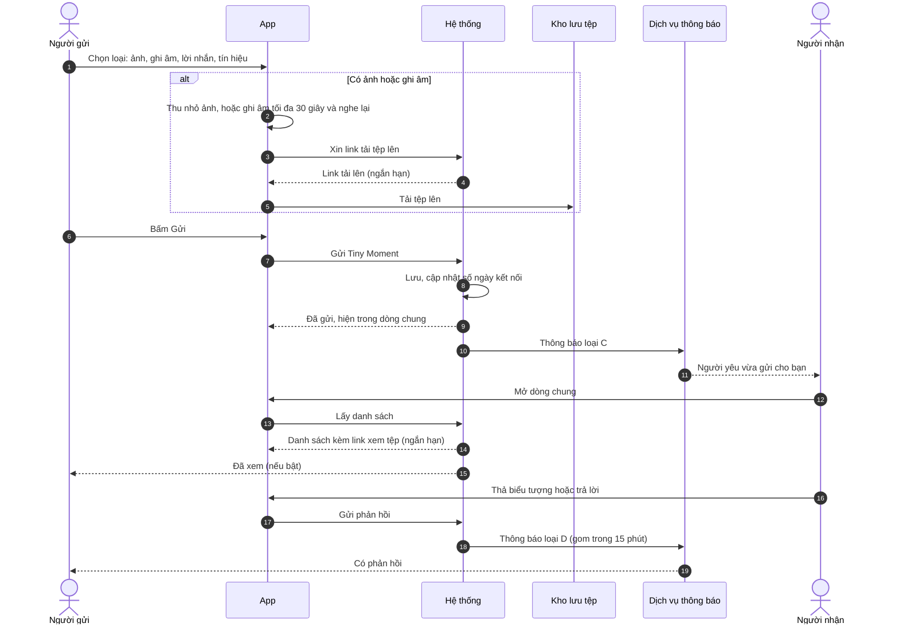

**Trường hợp đặc biệt:**

- Tải tệp lỗi giữa chừng: giữ bản nháp, cho thử lại.
- Người gửi xóa: xóa cho cả hai bên, tệp gốc bị xóa, link cũ không mở được.
- **Cách tính số ngày kết nối (nên có):** một ngày được tính khi cả hai đều có ít nhất 1 hoạt động. Hôm sau nếu chỉ có một người hoặc không ai hoạt động thì số quay về 0, kỷ lục vẫn giữ, không gửi thông báo, không hiện chữ "mất". Cách xử lý khi hai người lệch múi giờ lớn đang chờ chốt (câu hỏi 3 trong tài liệu yêu cầu).

---

## 9. Quyết định có gửi thông báo không

Luồng này dùng chung cho cả 8 loại thông báo (A đến H, xem mục 4.5 tài liệu yêu cầu).

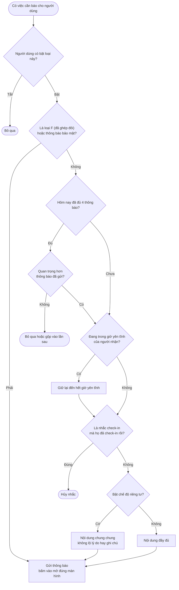

**Thứ tự ưu tiên khi vượt mức 4 thông báo:** B > C > D > A > G.

---

## 10. Kết thúc kết nối và xóa tài khoản

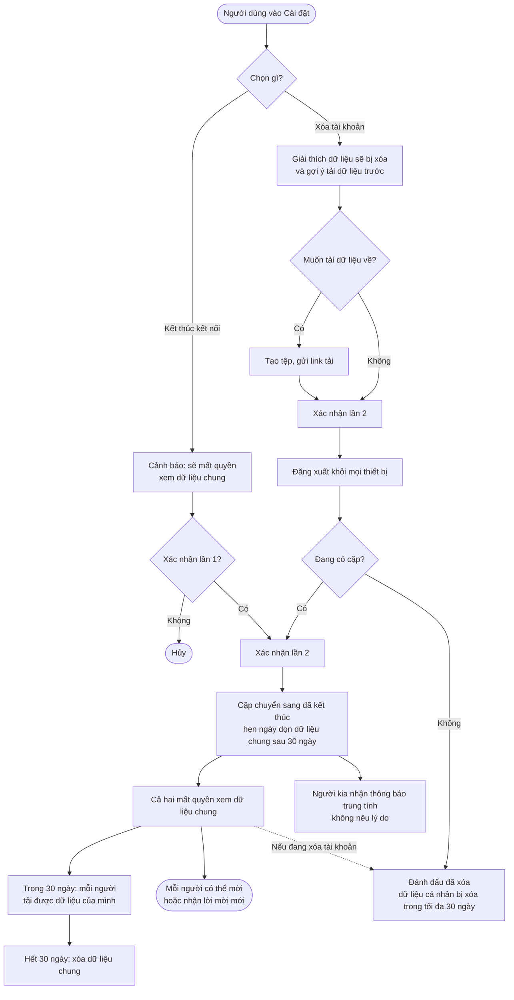

---

## 11. Một ngày điển hình (dùng để nghiệm thu)

**Kịch bản:** Linh ở Hà Nội, Nam ở New York, lệch nhau 12 giờ. Hai người đã ghép đôi.

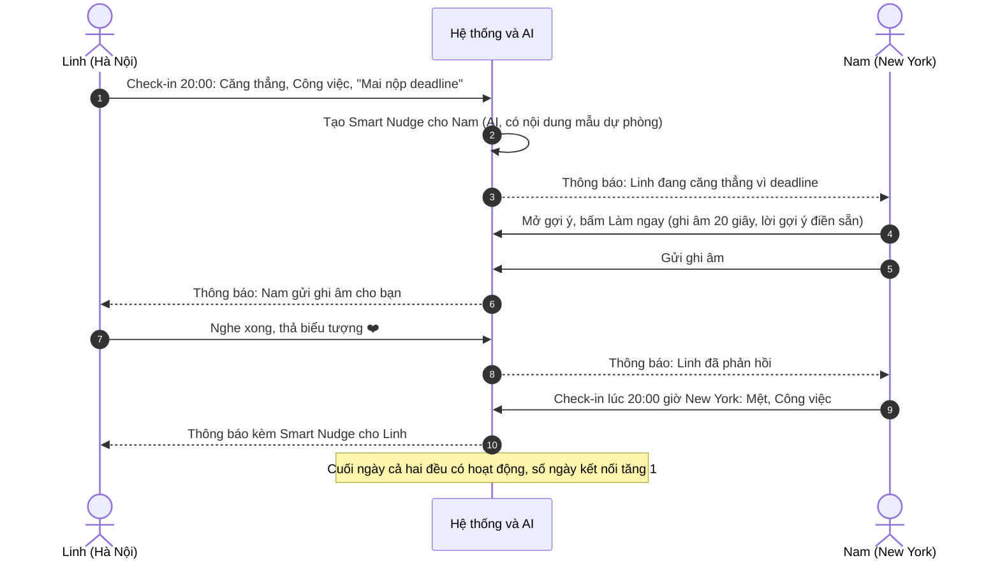

**Đạt khi:**

- Mọi thông báo đến đúng giờ địa phương của người nhận, không rơi vào giờ yên tĩnh.
- Gợi ý nhắc đúng chuyện "deadline".
- Nam gửi được sau tối đa 2 thao tác kể từ khi mở gợi ý.
- Dữ liệu trên hai điện thoại khớp nhau trong tối đa 5 giây khi cả hai đang mở app.

---

## Phụ lục: Vòng đời của các đối tượng chính

| Đối tượng | Các trạng thái và cách chuyển |
| --- | --- |
| Cặp | Đang chờ → (người kia chấp nhận) → Đang hoạt động → (kết nối bị kết thúc hoặc xóa tài khoản) → Đã kết thúc → (sau 30 ngày) → Dữ liệu bị xóa |
| Lời mời | Đang mở → Đã chấp nhận, hoặc Hết hạn, hoặc Bị hủy |
| Smart Nudge | Mới → Đã làm, hoặc Để sau (quay lại Mới một lần), hoặc Bỏ qua, hoặc Hết hạn sau 24 giờ |
| Check-in | Đầy đủ, hoặc Chỉ tâm trạng, hoặc Chỉ mình tôi (không báo người yêu, không tạo Smart Nudge) |

## Phụ lục: Việc cần chốt trước khi vẽ giao diện

1. Cách tính số ngày kết nối khi lệch múi giờ lớn (ảnh hưởng luồng 8 và 11).
2. Có bắt buộc số điện thoại khi đăng nhập không (ảnh hưởng luồng 2 và 3).
3. Nội dung và số điện thoại hỗ trợ khủng hoảng (ảnh hưởng luồng 6).
4. Giải pháp link nhớ lời mời sau khi cài app (ảnh hưởng luồng 3).
5. Màn hình Smart Nudge quyết định giá trị của cả sản phẩm, nên thiết kế và cho người thật dùng thử trước các màn hình khác.