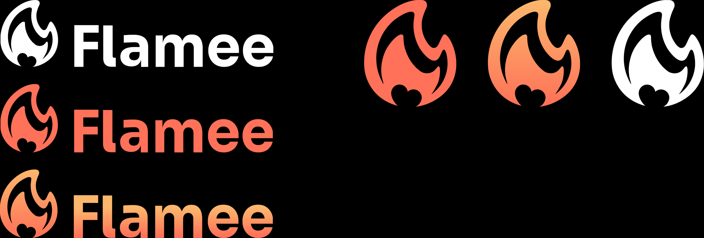

/* Logo final-04 1 */

position: relative;

width: 179px;

height: 207px;

/* Logo final-04 1 */

position: absolute;

left: 0%;

right: 0%;

top: 0%;

bottom: 0%;

background: url(Logo final-04.png);

/* Logo final-03 1 */

position: relative;

width: 179px;

height: 207px;

/* Logo final-03 1 */

position: absolute;

left: 0%;

right: 0%;

top: 0%;

bottom: 0%;

background: url(Logo final-03.png);

/* Logo final-02 1 */

position: relative;

width: 179px;

height: 207px;

/* Logo final-02 1 */

position: absolute;

left: 0%;

right: 0%;

top: 0%;

bottom: 0%;

background: url(Logo final-02.png);

/* Logo cạnh chữ-08 1 */

position: relative;

width: 528px;

height: 133px;

/* Logo cạnh chữ-08 1 */

position: absolute;

left: 0%;

right: 0%;

top: 0%;

bottom: 0%;

background: url(Logo cạnh chữ-08.png);

/* Logo cạnh chữ-06 1 */

position: relative;

width: 529px;

height: 130px;

/* Logo cạnh chữ-06 1 */

position: absolute;

left: 0%;

right: 0%;

top: 0%;

bottom: 0%;

background: url(Logo cạnh chữ-06.png);

/* Logo cạnh chữ-07 1 */

position: relative;

width: 529px;

height: 133px;

/* Logo cạnh chữ-07 1 */

position: absolute;

left: 0%;

right: 0%;

top: 0%;

bottom: 0%;

background: url(Logo cạnh chữ-07.png);

